# **Air Quality control**

We have designed and assembled an IoT closed loop air quality control device to be mounted on rUBot_2.0 prototype.

The mechanical structure is described bellow:


His main characteristics are: 
- **Raspberri Pi 4**: allows rubot's connection to the IoT and will control it's movement
- **Arduino Mega**: controls sensors and wheel's actuators
- **four omnidirectional wheels**: allow the robot to move in any desired direction
- **LIDAR (Laser Imaging Detection and Ranging)**: determines ranges by targeting an object or surface via an infrared laser, will allow object detection
- **two Logitech C270 cameras**: allow visualization of the rubot's environment via 3D visualizations software tools
- **two batteries (5V and 12V)** : will power all sensors and actuators


In this document we will describe:
- Device structure
- Web Arduino IoT Cloud SW description
- Sensors description
- Ozone generation device description
- PCB board design
- Arduino code 
- Experimental results


## **1. Device structure**

The device is conformed by the rUBot_2.0 prototype and the Air quality control circuit.

**a) rUBot model generation, spawn in a world environment and control** 

First of all, we have to create the "rubot_mecanum_description" package where we will create the rUBot model. In case you want to create it from scratch, type:
```shell
cd ~/Desktop/ROS_github/rubot_mecanum_ws/src
catkin_create_pkg rubot_mecanum_description rospy
cd ..
catkin_make
```

Then open the .bashrc file and verify the environment variables and source to the proper workspace:
```shell
source ~/Desktop/ROS_github/rubot_mecanum_ws/devel/setup.bash
```

Once the model is created, we can simulate the robot's behavour in a virtual environment close to the real one. For this purpose, we will create a new gazebo.launch file to spaen the robot in an empty world:
```shell
roslaunch rubot_mecanum_description gazebo.launch
roslaunch rubot_mecanum_description display.launch
```

There's also the option to generate a personalised world via Gazebo. After building the desired world, we can spawn the rUBot in it by creating a "nexus_world.launch" file:
```shell
roslaunch rubot_mecanum_description rubot_world.launch
```

As a final step, we can create a ROS Package "rubot_control" to perform the autonomous navigation:
```shell
cd ~/rubot_mecanum_ws/src
catkin_create_pkg rubot_control rospy std_msgs sensor_msgs geometry_msgs nav_msgs
cd ..
catkin_make
```
The movement of the robot can also be controlled by:
- keyboard or a joypad
- pragramatically in python creating a "/rubot_nav" node

**b) Air quality control circuit structure**

The air quality control circuit's main goal is to detect when the CO2 air concentration is too high so it can switch on an ozone generator that will help purify the air and bring the CO2 levels back to safe values. This data will be available to users via an Arduino IoT Cloud and accessible via pc an mobile devices. The circuit will be integrated into a PCB and it will be powered by the 5V rUBot's battery:

- a 30 pin ESP32 VROOM that will control all the circuit's components via an Arduino Code
- three different air data collection sensors (DHT22, MQ2, SDC30)
- an ozone generator 
- a MOSFET transistor that will help switch on and off the ozone generator
- an LED that will indicate when the ozone generator is on

This circuit will be mounted on top of the rUBot's platform and will be fetching data while the rUBot moves. 


## **2. Web Arduino IoT Cloud SW description**

To code this project's Arduino software, we will use the Arduino IoT Cloud web. This web is a platform that allows any user to create IoT Arduino projects and allows code writing, code uploading to any Arduino device that has Wi-Fi connection and data visualization thanks to a serial monitor or widget dashboard. The main advantage of this platform is that data will refresh and synchronise with the Arduino board even is the board is not connected to the PC. In other words, if the Arduino board is connected to a Wi-Fi network, the dashboard's data will continue to update in real time thanks to its connection to the IoT. To access the Arduino Cloud web, we will have to sign in into the Cloud and create an Arduino account.  

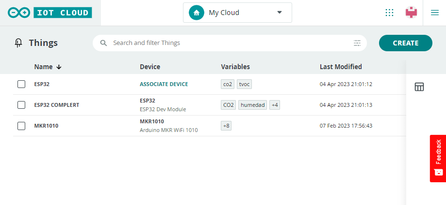

**1.** Once the Arduino account is created, the first thing to do when we want to create a new IoT Cloud project, is to set up a device onto the cloud. This can be easily done via the "Device" tab configuration.

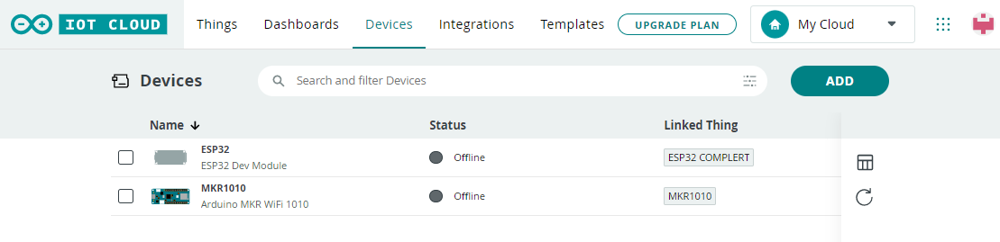

To configure the device, we will have to choose the "Set up a 3rd Party device" option. 

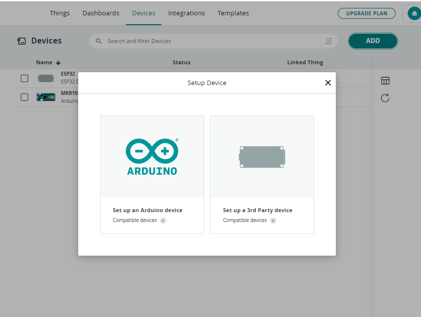

 **2.** Then, we can create a new Thing. In the Thing overview, we will have to configurate what Arduino device will be used, the Wi-Fi network we want to connect to and create variables that we can monitor and control. All changes made in the Thing overview will be automatically generated into the sketch file.

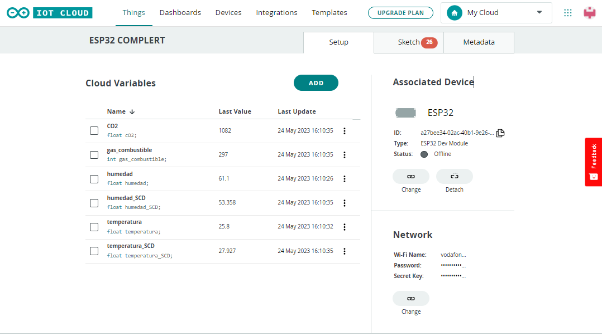

**3.** The next step is to create the project's variables via the "Add" button in the Thing overview. These variables can be of various types (float, integer, string, etc.) and can be defined as a read and/or write type variable. They are automatically generated into the sketch file and the variable's data will be monitored via the widget dashboard. 

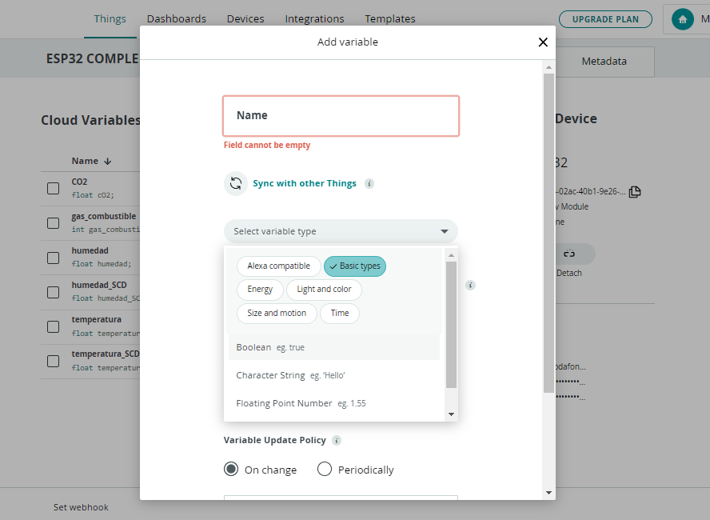

**4.** The Sketch file is where the device programming takes place. In this sketch, we will have to include all libraries and code lines needed for the application to work. Once the program is finished, we can upload it to the board by clicking the "Upload" button. To quickly view obtained data, we can open the Serial monitor. 

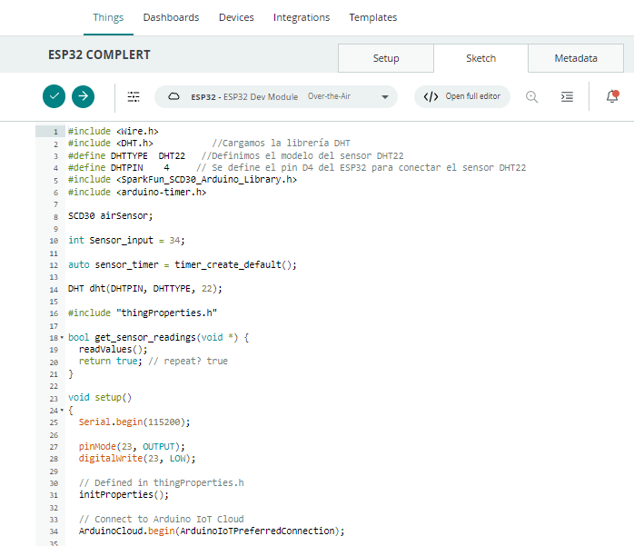

**5.** The last step is to create a new widget Dashboard via the "Dashboard" tab. We can include basically any king of widget to allow the visual representation of the variables we create. Here's an example of a dashboard with Gauge and Chart widgets:

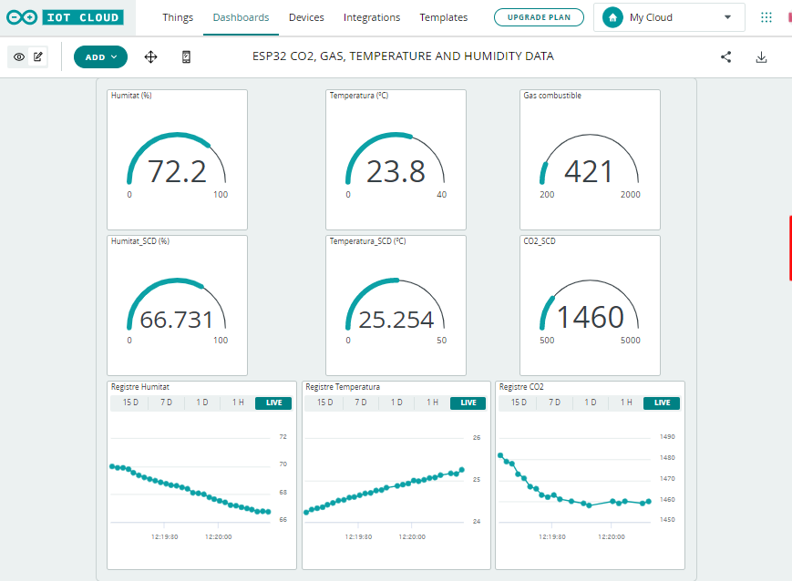

It is important to link the widgets to our Thing's variables so data can be monitored. This can be done by editing the settings of the desired widget.

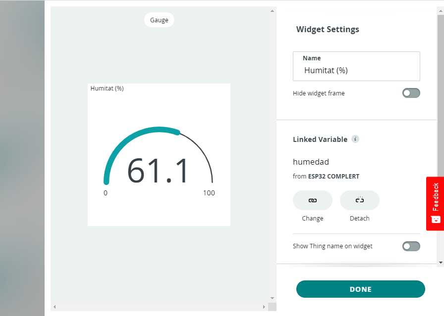

**Extra step**: If we want to take it to the next level, we can also download the IoT Remote app into our phones so we can monitor data without the need of a pc. The only thing needed is connection to a Wi-Fi network and to log in to the Arduino app with our Arduino account. Here's the dashboard view from the mobile app:

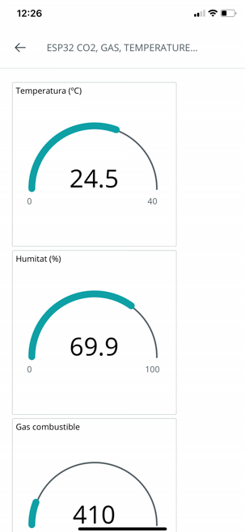


## **3. Sensors description**

In this project's air quality control circuit, three different sensors will be used to assure accurate and reliable CO2 atmosphere levels as well as gas, humidity and temperature values:

**MQ2 Gas sensor**: 

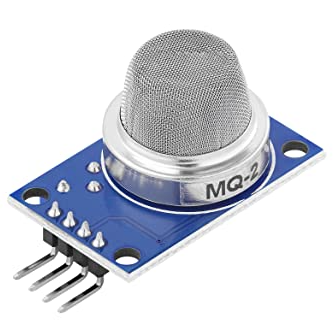

- The first sensor used is an MQ2 gas sensor,  that detects concentrations of different air gases such as propane, methane, hydrogen, alcohol, smoke and carbon monoxide. The gas' concentration is measured using a voltage divider network and the values are given in ppm (parts per million)

**DHT22 temperature and humidity sensor**: 

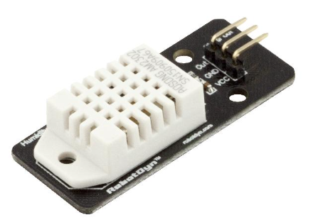

- The second sensor is a temperature and humidity sensor, the DHT22. It offers a high precision data acquisiton and stability due to it's temperature compensation and calibration. Humidity values are given in percentage units (%) and temperature values are given in degrees celcius (ºC).

**SCD30 CO2, temperature and humidity sensor**:

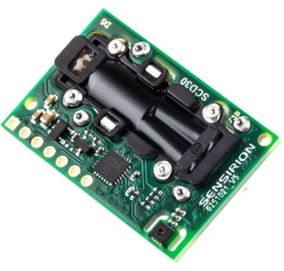

- The third and biggest sensor is the SCD30 Sensirion sensor, that measures carbon dioxide, temperature and humidity air values. The CO2 levels are given in ppm. Its main characteristic is its small size and height, which allows easy integration into different applications.
This particular sensor will be key for the whole air quality control device since the CO2 air concentration value is what will switch the ozone generator on and off.

## **4. Ozone generator device description**

An ozone generator is a device that intentionally produces ozone gas. Ozone (O3) is a gas that has an extra oxygen atom in comparison with the air we breathe (O2), and it is actually harmful for health. Nonetheless, it can be benefitial to purify air when it is used in small quantities (up to 50 ppb). Ozone generators are able to produce ozone by applying an electrical charge to the air that goes through it. This splits apart regular O2 atoms and forces them to attach to other O2 atoms, creating O3. It is important that no animals or humans are present in rooms where ozone generators are working (generating O3), that's why most of these devices are switched on at night or when rooms are empty, to prevent any kind of health harm.

The ozone generator used in this application is the "Handy Ozone Generator" by Feel Lagoom. It is a small device (15 x 15 cm) that works thanks to an integrated lithium battery that lasts up to 15h before needing to be recharged. For the circuit being, this integrated battery will not be used and the generator will be connected to a 5V pin from the ESP32. 

**Handy Ozone Generator**: 

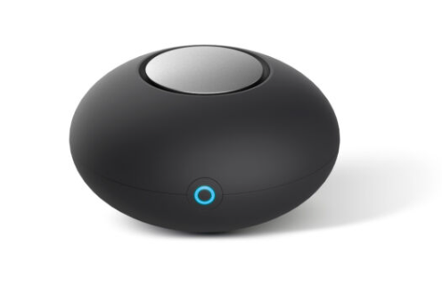

The device will be switched off by default, and will only be switched on when the CO2 levels detected by the SCD30 sensor are above a chosen threshold value. The CO2 air value is usually around 800 ppm in normal conditions, and will be considered harmful for health when it reaches values above 1200 ppm (for this specific application and its scope). Every time the 1200 ppm threshold is surpassed, the ozone generator will switch on and start to purify air, when the CO2 value goes down again under 1200 ppm, the ozone generator will switch off.

## **5. PCB Board design**

To design this circuit's PCD Board, various factors have to be taken into consideration. The first and most important one, the ESP32 Arduino has to be positioned in a way that allows its connection to every component that conforms the board, this means that it has to be placed at the center of the board **(1)**. Once the ESP32 is placed, the different sensors can be positioned around it. 

The sensors' board position depend on their connections to the ESP32. The DHT22 sensor has connections to the right-side of the Arduino (pins 3V3 to GPIO23) and the MQ2 has connections to the left-side of the Arduino (pins VIN to RESET). Knowing this, the DTH22 will be placed on the "lower" side of the Arduino **(2)** and the MQ2 on the "upper" side **(3)**. 

The only thing left to place on the board is the CO2 detection and O2 generation circuit. It is conformed by the SCD30, an LED, a transistor and an ozone generator. All of these components have to be placed close to each other, since they're interconnected. Plus, the SCD30 and the ozone generator are connected to the ESP32, either for power supply or I2C sensor data connection. The SCD30 will be placed near the ESP32 **(4)**, and the ozone generator near the border of the PCB, leaving a considerable amount of space around it since it's a quite big device **(5)**. In between these two components the LED and the transistor will be placed **(6)**.

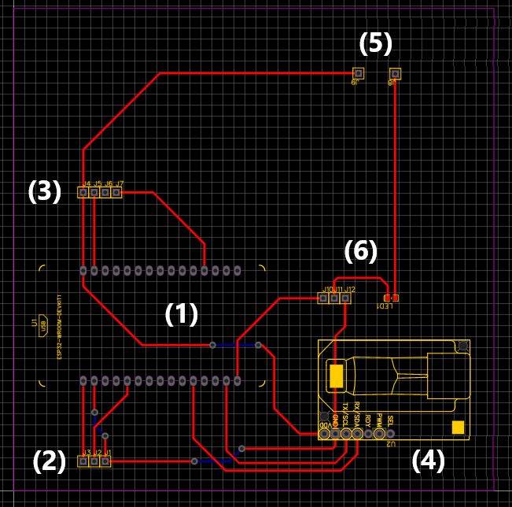

After all the placements are made, the PCB tracks are created. These are traced in the most efficient possible way, avoiding 90 degree angles and always making sure the distance between which one of them is sufficient to avoid creating a short circuit. Plus, we will make sure that all tracks end on the same layer side so pins can be easily welded into the board. 
The last step is to pour a GND layer on both sides of the board to maximise its performance and avoid intereferences between signals. 

The final product is an 11 x 11 cm PCB Board. Here's the 3D view of the finished board:

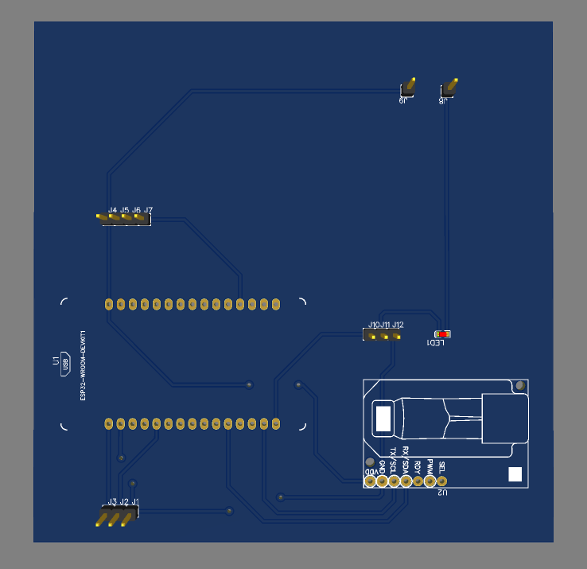

## **6. Arduino Code**

The air quality control circuit is controlled by the ESP32. Every circuit's component will be connected to the Arduino, including the ozone generator. 
An Arduino code is generated via Arduino Cloud to fetch and control every sensor's data. Its main aim is to display the fetched data on to the Arduino Cloud's Dashboard, so users can have access to CO2, gas, humidity and temperature air levels via IoT.

The first step is to include and define every sensor's library and ID. It is also important to identify the ESP32's pins that will be connected to every sensor:

```shell
#include <Wire.h>
#include <DHT.h>         //Include library for the DTH22 sensor
#define DHTTYPE  DHT22   //Define DHT22 sensor as DHT22
#define DHTPIN    4      // Define the ESP32 pin that enables connection with the DHT22 (in this case, pin number 4)
#include <SparkFun_SCD30_Arduino_Library.h> //Include library for the SCD30 sensor
#include <arduino-timer.h>

SCD30 airSensor;                            //Define the SCD30 sensor as airSensor

int Sensor_input = 34;                      //Define the ESP32 pin that enables connection with the MQ2 (pin number 34)

auto sensor_timer = timer_create_default(); //Create auto timer to fetch data periodically

DHT dht(DHTPIN, DHTTYPE, 22);               //Define the DHT22

#include "thingProperties.h"
```

Next, a boolean function is created to allow periodical data fetching from the sensors:

```shell
bool get_sensor_readings(void *) {
  readValues();
  return true; // repeat? true
}
```

A setup void is needed to initiate the sensors' and Arduino Cloud's connection. In the same void, the speed of data readings is indicated.

```shell
void setup()
{
  Serial.begin(115200);
  
  pinMode(23, OUTPUT);    //Define pin 23 from the ESP32 as an output, this will control the ozone generator's switch on and off
  digitalWrite(23, LOW);  //The output has a low value (0) by default
  
  // Defined in thingProperties.h
  initProperties();

  // Connect to Arduino IoT Cloud
  ArduinoCloud.begin(ArduinoIoTPreferredConnection);
  
  /*
     The following function allows you to obtain more information
     related to the state of network and IoT Cloud connection and errors
     the higher number the more granular information you’ll get.
     The default is 0 (only errors).
     Maximum is 4
 */
 
  setDebugMessageLevel(2);
  ArduinoCloud.printDebugInfo();
    
  dht.begin();                      //Begin the DHT22 sensor
  Wire.begin();                     //Begin wire

  if (airSensor.begin() == false)   //If the SCD30 sensor is not detected, the code will freeze
  {
    Serial.println("Air sensor not detected. Please check wiring. Freezing...");
    while (1)
      ;
  }

  sensor_timer.every(5000, get_sensor_readings);  //Fetch data every 5000 ms
}
```

In the main code loop, there are two essential functions:
- ArduinoCloud.update(): it is called to update the values on the cloud and the status of the update is displayed on the screen (or dashboard)
- sensor_timer.tick(): it sets a timer that calls a function which indicates when it is time to fetch data (in this case, every 5000 ms)

```shell
void loop()
{
  ArduinoCloud.update();
  
  sensor_timer.tick();
}
```
The readValues() void is responsible for every data reading, for each one of the sensors used. Here, the values will be read from the sensors and written onto the ArduinoCloud's display and dashboard created for this specific application.

```shell
void readValues(){  
  humedad = dht.readHumidity();                 //Read humidity from DHT22. The value will be saved as "humedad"
  temperatura = dht.readTemperature();          //Read temperature from DHT22. The value will be saved as "temperatura"
  gas_combustible = analogRead(Sensor_input);   //Read gas from the MQ2. The value will be saved as "gas_combustible"
  humedad_SCD = airSensor.getHumidity();        //Read humidity from the SC30. The value will be saved as "humedad_SCD"
  temperatura_SCD = airSensor.getTemperature(); //Read temperature from the SC30. The value will be saved as "temperatura_SCD"
  cO2 = airSensor.getCO2();                     //Read CO2 from the SC30. The value will be saved as "cO2"
  
  //Data is printed
  Serial.println("Humedad: "); 
  Serial.println(humedad);
  Serial.println("Temperatura: ");
  Serial.println(temperatura);
  Serial.println("Gas Sensor: ");  
  Serial.print(gas_combustible);   
  Serial.print("\t");
  Serial.print("\t");
  
  //If MQ2's gas values are above 1500 ppm, there will be a warning indicating that there's too much gas
  if (gas_combustible > 1500) {    
    Serial.println("Gas");  
  }
  else {
    Serial.println("No Gas");
  }
  
  Serial.println(cO2);
  Serial.println(temperatura_SCD, 1);
  Serial.println(humedad_SCD, 1);
  Serial.println("Waiting for new data");
  
  //If the CO2 SC30's levels are above 1000 ppm, the ozone generator will switch on
  if (cO2 > 1000)
  {
  pinMode(23, OUTPUT);
  digitalWrite(23, HIGH);
  }
  else {
  digitalWrite(23, LOW);   //Otherwise, it will be switched off
  }
  
  delay(500);
}
```
Finally, there are voids that are automatically created when new variables are defined. These variables correspond to each one of the sensors' data collection type. These voids are empty.

```shell
/*
  Since Humedad is READ_WRITE variable, onHumedadChange() is
  executed every time a new value is received from IoT Cloud.
*/
void onHumedadChange()  {
  // Add your code here to act upon Humedad change
}
/*
  Since Temperatura is READ_WRITE variable, onTemperaturaChange() is
  executed every time a new value is received from IoT Cloud.
*/
void onTemperaturaChange()  {
  // Add your code here to act upon Temperatura change
}
/*
  Since GasCombustible is READ_WRITE variable, onGasCombustibleChange() is
  executed every time a new value is received from IoT Cloud.
*/
void onGasCombustibleChange()  {
  // Add your code here to act upon GasCombustible change
}
/*
  Since HumedadSCD is READ_WRITE variable, onHumedadSCDChange() is
  executed every time a new value is received from IoT Cloud.
*/
void onHumedadSCDChange()  {
  // Add your code here to act upon HumedadSCD change
}
/*
  Since TemperaturaSCD is READ_WRITE variable, onTemperaturaSCDChange() is
  executed every time a new value is received from IoT Cloud.
*/
void onTemperaturaSCDChange()  {
  // Add your code here to act upon TemperaturaSCD change
}
/*
  Since CO2SCD is READ_WRITE variable, onCO2SCDChange() is
  executed every time a new value is received from IoT Cloud.
*/

void onCO2Change()  {
  // Add your code here to act upon CO2 change
}
```


Here's the full application code:

```shell
/*
  Reading CO2, humidity and temperature from the SCD30
  Reading Gas from MQ2
  Reading humidity and temperature from DHT22
  By: Liliana Oliveira 
  Universitat de Barcelona
  Date: May 2023
*/

#include <Wire.h>
#include <DHT.h>         //Include library for the DTH22 sensor
#define DHTTYPE  DHT22   //Define DHT22 sensor as DHT22
#define DHTPIN    4      // Define the ESP32 pin that enables connection with the DHT22 (in this case, pin number 4)
#include <SparkFun_SCD30_Arduino_Library.h> //Include library for the SCD30 sensor
#include <arduino-timer.h>

SCD30 airSensor;                            //Define the SCD30 sensor as airSensor

int Sensor_input = 34;                      //Define the ESP32 pin that enables connection with the MQ2 (pin number 34)

auto sensor_timer = timer_create_default(); //Create auto timer to fetch data periodically

DHT dht(DHTPIN, DHTTYPE, 22);               //Define the DHT22

#include "thingProperties.h"

//Boolean function that allows periodical data fetching from the sensors
bool get_sensor_readings(void *) {
  readValues();
  return true; // repeat? true
}

void setup()
{
  Serial.begin(115200);
  
  pinMode(23, OUTPUT);    //Define pin 23 from the ESP32 as an output. This will control the ozone generator's switch on and off.
  digitalWrite(23, LOW);  //The output has a low value (0) by default
  
  // Defined in thingProperties.h
  initProperties();

  // Connect to Arduino IoT Cloud
  ArduinoCloud.begin(ArduinoIoTPreferredConnection);
  
  /*
     The following function allows you to obtain more information
     related to the state of network and IoT Cloud connection and errors
     the higher number the more granular information you’ll get.
     The default is 0 (only errors).
     Maximum is 4
 */
  setDebugMessageLevel(2);
  ArduinoCloud.printDebugInfo();
    
  dht.begin();                      //Begin the DHT22 sensor
  Wire.begin();                     //Begin wire

  if (airSensor.begin() == false)   //If the SCD30 sensor is not detected, the code will freeze
  {
    Serial.println("Air sensor not detected. Please check wiring. Freezing...");
    while (1)
      ;
  }

  sensor_timer.every(5000, get_sensor_readings);  //Fetch data every 5000 ms
}

void loop()
{
  ArduinoCloud.update();
  
  sensor_timer.tick();
}

//ReadValues void where data is fetched and displayed on the Arduino Cloud's monitor and Dashboard 
void readValues(){  
  humedad = dht.readHumidity();                 //Read humidity from DHT22. The value will be saved as "humedad"
  temperatura = dht.readTemperature();          //Read temperature from DHT22. The value will be saved as "temperatura"
  gas_combustible = analogRead(Sensor_input);   //Read gas from the MQ2. The value will be saved as "gas_combustible"
  humedad_SCD = airSensor.getHumidity();        //Read humidity from the SC30. The value will be saved as "humedad_SCD"
  temperatura_SCD = airSensor.getTemperature(); //Read temperature from the SC30. The value will be saved as "temperatura_SCD"
  cO2 = airSensor.getCO2();                     //Read CO2 from the SC30. The value will be saved as "cO2"
  
  //Data is printed
  Serial.println("Humedad: "); 
  Serial.println(humedad);
  Serial.println("Temperatura: ");
  Serial.println(temperatura);
  Serial.println("Gas Sensor: ");  
  Serial.print(gas_combustible);   
  Serial.print("\t");
  Serial.print("\t");
  
  //If MQ2's gas values are above 1500 ppm, there will be a warning indicating that there's too much gas
  if (gas_combustible > 1500) {    
    Serial.println("Gas");  
  }
  else {
    Serial.println("No Gas");
  }
  
  Serial.println(cO2);
  Serial.println(temperatura_SCD, 1);
  Serial.println(humedad_SCD, 1);
  Serial.println("Waiting for new data");
  
  //If the CO2 SC30's levels are above 1000 ppm, the ozone generator will switch on
  if (cO2 > 1000)
  {
  pinMode(23, OUTPUT);
  digitalWrite(23, HIGH);
  }
  else {
  digitalWrite(23, LOW);   //Otherwise, it will be switched off
  }
  
  delay(500);
}

/*
  Since Humedad is READ_WRITE variable, onHumedadChange() is
  executed every time a new value is received from IoT Cloud.
*/
void onHumedadChange()  {
  // Add your code here to act upon Humedad change
}
/*
  Since Temperatura is READ_WRITE variable, onTemperaturaChange() is
  executed every time a new value is received from IoT Cloud.
*/
void onTemperaturaChange()  {
  // Add your code here to act upon Temperatura change
}
/*
  Since GasCombustible is READ_WRITE variable, onGasCombustibleChange() is
  executed every time a new value is received from IoT Cloud.
*/
void onGasCombustibleChange()  {
  // Add your code here to act upon GasCombustible change
}
/*
  Since HumedadSCD is READ_WRITE variable, onHumedadSCDChange() is
  executed every time a new value is received from IoT Cloud.
*/
void onHumedadSCDChange()  {
  // Add your code here to act upon HumedadSCD change
}
/*
  Since TemperaturaSCD is READ_WRITE variable, onTemperaturaSCDChange() is
  executed every time a new value is received from IoT Cloud.
*/
void onTemperaturaSCDChange()  {
  // Add your code here to act upon TemperaturaSCD change
}
/*
  Since CO2SCD is READ_WRITE variable, onCO2SCDChange() is
  executed every time a new value is received from IoT Cloud.
*/

void onCO2Change()  {
  // Add your code here to act upon CO2 change
}
